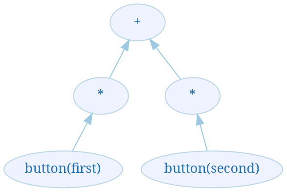
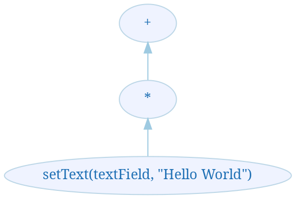

This is a second part of a progress report on my attempt to model a process algebra as an expression rewriting machine. This part covers the theoretical foundations of the two implementations (engines) of SubScript: the [standard one](https://github.com/scala-subscript/subscript), and [FreeACP](https://github.com/anatoliykmetyuk/free-acp), the one I am building. The other two parts:

- [Rewriting Process Algebra, Part 1: Introduction to Process Algebra](/blog/2017/01/11/rewriting-process-algebra-part-1-introduction-to-process-algebra.html)
- [Rewriting Process Algebra, Part 3: FreeACP Implementation](/blog/2017/01/13/rewriting-process-algebra-part-3-freeacp-implementation.html)

# Standard SubScript implementation

The standard [implementation](https://github.com/scala-subscript/subscript) of SubScript in Scala takes the *coordinating* approach to the problem with the help of the actor model.

Every process algebra entity, such as operator or atomic action, is represented by its own node (actor) in an execution graph (actor hierarchy). Operators become actors that supervise other actors - operands of these operators. The lower-level actors report all the events that pertain to them to their supervisors. Based on the events, the supervisors coordinate the execution of their subordinates.

These reported events include:

- An atomic action being successfully completed in one of the operator's subordinates.
- An operator itself has completed successfully, according to the definition of the particular operator.
- Some of the operands of an operator requested a break of this operator's execution (behaves roughly the same as a brake of a loop in Java).

## Example
Let us have a look at how our GUI example from [Part 1](/blog/2017/01/11/rewriting-process-algebra-part-1-introduction-to-process-algebra.html) of this series would have been executed in the standard implementation:

1. A hierarchy of actors (nodes) is created:

Note that under the `*` operators, only the `button()` operands are created, but not the `setText()` ones. This is because in `button(first) * setText(textField, "Hello World")`, the `setText(textField, "Hello World")` operand is not evaluated until `button(first)` finishes successfully - hence, `setText()` can be ignored until such an event happens.

2. When the button `first` is pressed, `button(first)` is finishes its evaluation (execution) with success - `ε`. The corresponding actor sends this event as a message to its supervising actor, `*`, and stops itself, removing itself from the hierarchy. `*` in turn forwards the message to `+`. Both these actors have the information that `first` has successfully finished at this point.
3. `+` acts upon this information by cancelling its second operand
4. `*` acts upon this information by instantiating an actor corresponding to its second operand, `setText(textField, "Hello World")`, and sending a message to it, ordering it to start execution. The resulting hierarchy after this step is as follows: 


## Problem
Actors and communication between them are hard to explore in mathematical fashion. This is why, the motivation for an alternative implementation of SubScript, FreeACP, is to define an engine for SubScript in mathematical terms rather than engineering ones.

# Rewriting engine implementation
While the standard implementation of SubScript uses the coordinating approach discussed above, FreeACP uses the **rewriting** approach. Its idea is to rewrite SubScript expressions, gradually simplifying them, until they are reduced to `ε` or `δ`.

The rewritings proceed according to the engine axioms. The **engine axioms** (later on, when "axioms" are mentioned, "engine axioms" are meant) are the ground truth rules according to which one expression can be transformed to another. In their current state, these axioms are partially influenced by the **process algebra axioms** of ACP, but the two concepts should not be confused. For the current implementation, the process algebra axioms alone turned out to be insufficient to describe the reduction of any PA expression to `ε` or `δ`, hence this alternative concept is introduced. It is my hope, however, that in the future the two concepts can be brought under the same theoretical framework.

In the process of rewritings, the AAs are **evaluated** (executed) according to the engine axioms. An evaluation of AA is a process of execution of whatever instructions it caries, getting `ε` or `δ` as a result (depending on whether this execution was successful).

## Example
Let us see how our GUI example behaves under the rewriting approach.

First, we need to define the axioms we are working under (note that the axioms below are ad-hoc ones, for the sake of this example only. The real engine is built upon different axioms):

$\\(1):\frac{ax+by}{a:\varepsilon \rightarrow x; \delta \rightarrow by}\\
\phantom{(1):)} b:\varepsilon \rightarrow y; \delta \rightarrow ax
\\(2):\frac{ax}{a: r \rightarrow rx}
\\(3):\varepsilon x = x\varepsilon = x
\\(4):\delta x = \delta$

The axioms with the horizontal bar are further discussed in the "Axioms" section. Roughly, they dictate how to evaluate the expressions above the bar, and, depending on the result of this evaluation, rewrite the expression as described by the right-hand side expression of the arrow.

For example, `(1)` should be interpreted as follows. Given an expression of the form `ax + by`, where `a` and `b` are AAs, it is possible to rewrite it by evaluating `a` and `b`. Whichever finishes its evaluation first, determines how to rewrite the expression above the bar. If `a` evaluates first and it evaluates to `ε`, the expression above the bar should be rewritten to `x`; if `a` evaluates to `δ`, the expression above the bar should be rewritten to `by`. The rules for `b` are similar.

Now let us return to our GUI example:

```scala
button(first ) * setText(textField, "Hello World"   ) +
button(second) * setText(textField, "Something Else")
```

Under `(1)` axiom, we need to evaluate the first AAs of both expressions - operands of `+`, see which one has completed first and rewrite the expression according to the axiom

Assume `button(first)` has completed first. By `(1)`, the expression will be rewritten to `setText(textField, "Hello World")`, which by `(3)` is rewritten to `setText(textField, "Hello World") * ε`. By `(2)`, `setText(textField, "Hello World")` will be evaluated. In the process of evaluation, a side effect of setting the `textField`'s text to `"Hello World"` will occur. Assuming the action completed successfully and hence evaluated to `ε`, by `(2)` the expression will rewrite to `ε * ε`, which by `(3)` is just `ε`. This way, we computed the result of the original PA expression to be `ε`, which means the program executed without errors, as we wanted it to.

## Suspended computations
Some AAs can take time to evaluate. For example, in case of `button(first)`, a reasonable implementation of this AA will wait until the user has pressed `first` and will be considered successful (evaluates to `ε`) when this wait is completed. But it takes time for a user to press the button. Hence, the evaluation of such an AA can also take time. However, it is often necessary to know the result of such an evaluation to proceed with the rewritings. If the evaluation of AA is not immediate, we shall call it a **suspended computation**.

Functional Programming offers a standard way of treatment for such a scenario: If the result of the computation is of type `A`, it is wrapped into a suspension type and becomes `S[A]`. If `S` is a functor, we can map `S[A]` and apply the rewriting rule within the map function as if we already knew the result `A`. After the mapping, we get `S[B]`, where `B` is an expression this one should be rewritten to once `A` is available.

## Axioms
Hence, there are two kinds of axioms: rewriting axioms and suspension axioms. The latter are used in situations when we need to wait for some potentially long-running computation to finish to do the rewriting; the former are for situations when this is not the case.

For example, this is a set of axioms for the sequential composition of processes:

$\\\textbf{Rewriting Axioms}
\\\phantom{ }[*]() = \varepsilon
\\\phantom{ }[*]([*](x)::y) = [*](x::y)
\\\phantom{ }[*](\varepsilon::x) = x
\\\phantom{ }[*](\delta::x) = \delta
\\
\\\textbf{Suspension Axioms}
\\\frac{[*](a::x)}{a\rightarrow[*](r::x)}$

A sequence is presented as `[*](list)`, where `list` is a list of expressions, and `::` is concatenation.

The rewriting axioms are of the form `a = b`.

The suspension axioms work on the trees for which there are some suspended computations to compute before it is possible to apply rewriting axioms. They have a horizontal bar, above which is the pattern with one or more AAs that need to be evaluated. Below the bar, there are instructions on how to map the result of AA evaluation to the new tree which we will rewrite the current one with.

It is possible to simplify expression like `εx` without any "heavy" execution, using a rewriting axiom: empty action `ε` followed by some process `x` is the same as `x`. However, for some atom `a`, we can not simplify `ax` without knowing the outcome of `a`. So a suspension axiom is used here to compute the result `r` of `a`, and the rewriting rule is to substitute `r` in place of `a`.

Speaking in terms of Category Theory, given `a: S[A]` and a tree `a * x` that needs rewriting and this particular suspension axiom can work on, the rewritten tree is boxed in the suspension type `S`: `a.map(_ * x)`, of type `S[Tree]`.

## Execution semantics
A process algebra engine which works via expression rewriting invokes the rewriting axioms on the input tree until a suspension axiom is available, in which case the suspension axiom will be invoked. This continues until the tree is simplified to `ε` - success, or `δ` - failure.

Precisely, the algorithm is as follows:

1. If a suspension axiom is applicable, apply it and wait for the resulting tree. Once the resulting tree is available, restart this algorithm recursively with this tree as an input.
2. Otherwise, if the input tree is the terminal element (either `ε` or `δ`), return it.
3. Otherwise, apply a rewrite axiom and recursively feed the result to this algorithm.

# Conclusion
This part covered the theory and motivation for the rewriting-based implementation of SubScript, as well as the theory behind the standard implementation. In the [third part](/blog/2017/01/13/rewriting-process-algebra-part-3-freeacp-implementation.html), we will dive into the code and survey the architectural highlights of the work done so far in this direction.
