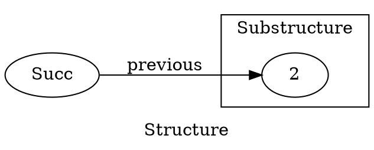
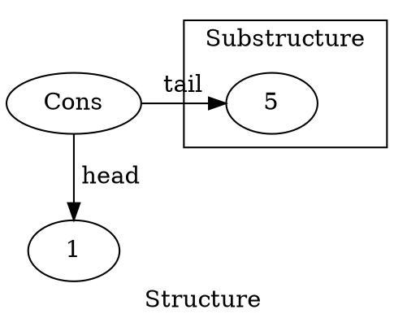
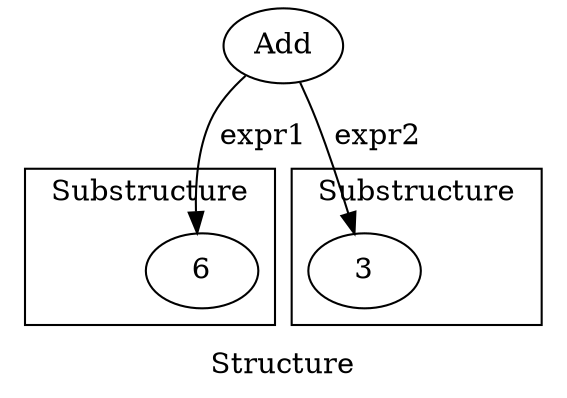
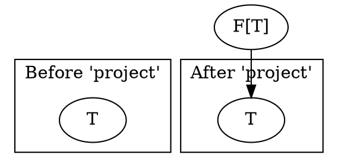
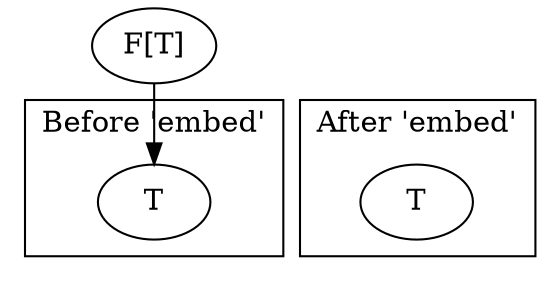

> Recursion is the GOTO of functional programming - Erik Meijer[^1]

[^1]: [https://twitter.com/headinthebox/status/384105824315928577?lang=en](https://twitter.com/headinthebox/status/384105824315928577?lang=en)

# Recursive data structures
In our daily programming life, we encounter recursive data structures on a regular basis. The best-known examples include linked lists and trees. Often working with such data structures we have a need to evaluate (collapse) them to a value. For example: 

- Given a list of integers, say 1, 2 and 3, one may want to find their sum 6.
- Given a parser of arithmetic expressions, such as `2 * 3 + 3`, we can expect it to produce a tree out of that expression - `Add(Mult(Num(2), Num(3)), Num(3))`. Such trees often need to be evaluated by actually performing these mathematical operations.
- A more abstract example: natural numbers. Given the number zero and an ability to construct a successor of any natural number, you can construct all the natural numbers. If `Zero` is such a zero number, and `Succ(x)` constructs a natural number following `x`, `Succ(Succ(Succ(Zero)))` can represent `3`. This is also a recursive structure, and the simplest operation you want to do on it is to actually evaluate it to an `Int`: `Nat => Int`.

In this article, we shall see how all of these examples involve recursion. [Don't Repeat Yourself (DRY)](https://en.wikipedia.org/wiki/Don't_repeat_yourself) is one of the fundamental principles of programming - so, if we repeat recursion from example to example, we should abstract it away. We shall see how to do that.

But first, let us set the foundation by doing all of the above examples in code.

## Natural Numbers
Here is how an implementation of natural numbers might look like:

```{.scala include="code/matryoshka-intro/src/main/scala/matryoshkaintro/C1NonDry.scala" snippet="NatDef"}
```

And here is a visualization of the number 3 represented this way:

```{.graphviz width=100% #nat_diagram}
digraph G { label=" Structure " rankdir=LR
  S3 [label=" Succ "]

  subgraph cluster1 { label=" Substructure " graph[style=solid]
    S2 [label=" Succ "]

    subgraph cluster2 {
      S1 [label=" Succ "]
      
      subgraph cluster3 {
        "Zero"
      }
    }
  }

  S3 -> S2 -> S1 -> Zero [label=" previous "]
} 
```

This would correspond to `Succ(Succ(Succ(Zero)))`. Note the recursive nature of this structure: a smaller substructure of the same type is present in every structure (except the terminal one, `Zero`).

Now, let us see how to evaluate a natural number to an `Int`. In order to do this for an arbitrary `Succ(x)`, we need to evaluate `x` and add 1 to the result. `Zero` should evaluate to 0:

```{.scala include="code/matryoshka-intro/src/main/scala/matryoshkaintro/C1NonDry.scala" snippet="NatEx"}
```

## Lists
Now let us see how to implement a list as a recursive structure:

```{.scala include="code/matryoshka-intro/src/main/scala/matryoshkaintro/C1NonDry.scala" snippet="ListDef"}
```

A list is either an empty list or a recursive structure that has a `head` element and a `tail` - a sublist representing all the elements following the `head`. For simplicity, we only consider lists of `Int`.

Here is how a list of `1, 2, 3` looks like:

```{.graphviz #list_diagram}
digraph G { label=" Structure " rankdir=TB newrank=true

  N3 [label=" Cons "]
  L3 [label=" 1 "]

  subgraph cluster1 { label=" Substructure " graph[style=solid]
    N2 [label=" Cons "]
    L2 [label=" 2 "]
    subgraph cluster2 {
      N1 [label=" Cons "]
      L1 [label=" 3 "]
      subgraph cluster3 { Empty }
    }
  }
  {rank=same Empty N1 N2 N3}

  N3 -> N2 -> N1 -> Empty [label="tail "]

  N3 -> L3 [label=" head"]
  N2 -> L2 [label=" head"]
  N1 -> L1 [label=" head"]
}
```

In order to find the sum of all the elements in a list, we should add its `head` to the sum of all the elements of its `tail`. If the list is `Empty`, the result of the summation is 0:

```{.scala include="code/matryoshka-intro/src/main/scala/matryoshkaintro/C1NonDry.scala" snippet="ListEx"}
```

## Expressions
Finally, this is a definition of a tree aiming to represent mathematical expression:

```{.scala include="code/matryoshka-intro/src/main/scala/matryoshkaintro/C1NonDry.scala" snippet="ExprDef"}
```

We have two node types for the summation and the multiplication, and one leaf type for the numbers.

Here is how an expression `2 * 3 + 3` looks like:

```{.graphviz #expr_diagram}
digraph G { label=" Structure " rankdir=TB newrank=true
  Add

  subgraph cluster1 { label=" Substructure " graph[style=solid]
    Mult
    subgraph cluster3 { Num1[label=" Num "] Lit1[label=" 2 "] }
    subgraph cluster4 { Num2[label=" Num "] Lit2[label=" 3 "] } 
  }

  subgraph cluster2 { label=" Substructure " Num3[label=" Num "] Lit3[label=" 3 "] }

  {rank=same Mult Num3}

  Add -> Mult[label=" expr1 "]
  Add -> Num3[label=" expr2 "]

  Mult -> Num1[label=" expr1 "]
  Mult -> Num2[label=" expr2 "]

  Num1 -> Lit1[label=" literal "]
  Num2 -> Lit2[label=" literal "]
  Num3 -> Lit3[label=" literal "]
}
```

How do we evaluate it? If it is a node representing a mathematical operation, first we need to evaluate its children and then do an operation represented by this node. If it is a leaf - a number - it just evaluates that number:

```{.scala include="code/matryoshka-intro/src/main/scala/matryoshkaintro/C1NonDry.scala" snippet="ExprEx"}
```

# Generalisation
## Structure preserving transformations
Intuitively, every example above is similar. All of them involve a recursive structure that is collapsed from the "bottom" (the terminal element with no child substructures) to the "top" (the root structure). What is in common between the `natToInt`, `sumList` and `eval` functions? Can we abstract away these common elements, so that every one of these functions can be expressed in the same terms?

- Every example works on a recursive structure - a structure that has substructures of the same type as parts of itself.
- They all involve recursive calls in order to transform these substructures. So, `natToInt` is called recursively on `previous` in order to evaluate `Succ(previous)`.
- The results of these transformations are combined according to the parent structure.
    - In `sumList(Cons(head, tail))`, `head` is a part of the parent structure. `tail` is a substructure that is evaluated recursively via `sumList(tail)` and then combined with that `head` via addition.
    - In `eval` of either `Add` or `Mult`, we first need to call `eval` on the child expressions of these nodes, and then combine them depending on the parent structure - if it is `Add`, we do addition, if `Mult` - multiplication.

A better way to look at it is as if we were replacing the substructures by their evaluations and then evaluating the resulting structure.

For example, when evaluating a `Nat` depicted by [the diagram above](#nat_diagram), the next step of its evaluation would look as follows:



Effectively, we have `Succ(previous = 2)`, which is then collapsed into `1 + 2` == `3`. However, `previous` is supposed to be a `Nat`, not an `Int`. In order to be able to write the above statement, we can allow the substructure to have an arbitrary type: `Succ[A](previous: A)`.

Similarly, the next step for the `IntList` [depicted](#list_diagram) above will be:



This is effectively a `Cons[Int](head = 1, tail = 5)` (again, notice how we introduce a type parameter for the substructure). After that, the `head` is added to the new `tail`, resulting in `6`

Finally, for the `Expr` [above](#expr_diagram), the next step is to evaluate both of its two substructures:




This is an `Add[Int](expr1 = 6, expr2 = 3)`, and the next step is to collapse it by doing `6 + 3`.

We are dealing with a *structure-preserving transformation* here. These kind of transformations are well understood in terms of [functors](https://en.wikipedia.org/wiki/Functor).

If we redefine our recursive structures such that they are parameterized by the type of their substructure, their types will have a form `F[A]` and we will be able to define functor instances for them.

Ordinarily, `A` in these `F[A]` is another `F[_]` (a substructure, reflecting the recursive nature of the parent structure) or `Nothing` (for terminal elements that do not have substructures). In our examples, we first do a `map`, turning `F[A]` into `F[B]`, where `B` is the type we are evaluating the structure into (in all our examples, `B` is `Int`). Next, given `F[B]`, we collapse it into a `B`. A function `F[B] => B` is called an *Algebra*[^3][^4].

Now let us see how this theory can be applied in practice.

[^3]: [Matryoshka definition](https://github.com/slamdata/matryoshka/blob/8dbabe9a9c21158abdb1d4d5ff2fe7a1f416f1d6/core/shared/src/main/scala/matryoshka/package.scala#L53)
[^4]: [https://en.wikipedia.org/wiki/F-algebra](https://en.wikipedia.org/wiki/F-algebra)

## New definitions for the recursive structures
In all our data structures, we need to specify the type of the substructures as a type parameter, so that we can then evaluate these substructures in a way that preserves the parent structure, via `map`.

The new definitions can go as follows:

```{.scala include="code/matryoshka-intro/src/main/scala/matryoshkaintro/C2Generalisation.scala" snippet="Defs"}
```

## Functors
If we want to use `map` on these data structures, they need functor instances. The definitions below are straightforward (do not forget to `import scalaz._, Scalaz._`, which is needed to bring functors in scope):

```{.scala include="code/matryoshka-intro/src/main/scala/matryoshkaintro/C2Generalisation.scala" snippet="Functors"}
```

## Catamorphism: first attempt
As discussed above, all we need to collapse a recursive structure is to map its substructures by the collapse function and then evaluate the resulting structure via an algebra. This recursion scheme is called a *catamorphism*[^2]. Let us try to define it:

```{.scala include="code/matryoshka-intro/src/main/scala/matryoshkaintro/C2Generalisation.scala" snippet="CataWrong"}
```

There is one problem with this code, however. In a recursive structure, `T` is supposed to be of the same type as `F[T]` by definition. Or else we will not be able to map it by `cata` as above, since `cata` will need a `Functor[T]`. In other words, `F[T] == T`. If so, we should also be able to write `structure: T` instead of `structure: F[T]` in the signature. Obviously, we can not have that in Scala, so what do we do?

[^2]: [http://citeseerx.ist.psu.edu/viewdoc/summary?doi=10.1.1.41.125](http://citeseerx.ist.psu.edu/viewdoc/summary?doi=10.1.1.41.125)

## Fixed-point types
### Theory
A [fixed point](https://en.wikipedia.org/wiki/Fixed_point_(mathematics)) of a function `f(_)` is a value `x` such that `f(x) == x`. We can think of a higher-order function `fix` that computes a fixed point of its argument: `fix(f) == x` such that `f(x) == x`. By extension, `fix(f) == f(fix(f))` holds.

What if we bring the same ideas to the type theory? By analogy, a *fixed-point type* of a higher-kinded type `F[_]` is some type `T` such that `F[T] == T` - precisely what we need. We can also have a type `Fix[F[_]]`, such that `Fix[F] == F[Fix[F]]`.

Fixed-point types are interesting, because they can represent a recursive structure of any desired depth as a single type:

```scala
Fix[F] == F[Fix[F]] == F[F[Fix[F]]] == ...
```

### Practice
I am not aware of a way you can define `Fix[F[_]]` so that the above equality holds - the compiler will think `F[T] != T` for any `F` and `T`, as far as I know.

It is possible to think of a workaround, though. In our `cata` definition above, we need to know that `F[T] == T` so that we can treat `T` as if it was `F[T]`. So in practice, we do not need to convince the compiler in that equality - a simple function `T => F[T]` is enough.

We can emulate the fixed-point type computation as in the theory above as follows:

```{.scala include="code/matryoshka-intro/src/main/scala/matryoshkaintro/C2Generalisation.scala" snippet="Fix"}
```

So we just wrap an `F[_]` in this case class. `Fix[F] => F[Fix[F]]` can be defined as simply `fix => fix.unfix`.

## Catamorphism: second attempt
Now we can define the catamorphism on a fixed-point type of a structure `F` as follows:

```{.scala include="code/matryoshka-intro/src/main/scala/matryoshkaintro/C2Generalisation.scala" snippet="CataRight"}
```

## Examples using `cata`
Now we can use the new `cata` to define our examples:

```{.scala include="code/matryoshka-intro/src/main/scala/matryoshkaintro/C2Generalisation.scala" snippet="Examples"}
```

First thing that catches the eye, probably, is how we need to embed every layer of the recursive structures into `Fix`. This is cumbersome, but fine as for the proof of concept.

Notice how all of the examples are now expressed in terms of one function - `cata`. We have successfully abstracted the common parts of the recursive structure collapse task.

Also, notice how we have gotten rid of the recursive calls in all of our examples. The recursion is now abstracted away in `cata`, so that the user does not need to deal with it directly.

# Matryoshka
Catamorphisms are not the only recursion scheme out there. Many more exist. And, of course, you do not need to implement them from scratch. [Matryoshka](https://github.com/slamdata/matryoshka) is a library that specializes on implementing recursion schemes on fixed-point types of  recursive structures.

## Recursion scheme mechanics
```{.plantuml width=100%}
"Based[T]" <|-- "Recursive[T]"  : extends
"Based[T]" <|-- "Corecursive[T]": extends

"Recursive[T]"   .. Recursive  : companion
"Corecursive[T]" .. Corecursive: companion

"Recursive[T]"   <|-- "Birecursive[T]": extends
"Corecursive[T]" <|-- "Birecursive[T]": extends

"Birecursive[T]" .. Birecursive: companion

class Based[T] <<(T,aqua)>> {
  type Base[A]
}

class Recursive[T] <<(T,aqua)>> {
  {abstract} def project(t: T)(implicit BF: Functor[Base]): Base[T]
  ---
  def cata[A](t: T)(f: Algebra[Base, A])(implicit BF: Functor[Base]): A
  ...
}

class Recursive <<O,green>> {
  type Aux[T, F[_]] = Recursive[T] { type Base[A] = F[A] }
}

class Corecursive[T] <<T,aqua)>> {
  {abstract} def embed(t: Base[T])(implicit BF: Functor[Base]): T
  ---
  def ana[A](a: A)(f: Coalgebra[Base, A])(implicit BF: Functor[Base]): T
  ...
}

class Corecursive <<O,green>> {
  type Aux[T, F[_]] = Corecursive[T] { type Base[A] = F[A] }
}

class Birecursive[T] <<T,aqua>>

class Birecursive <<O,green>> {
  type Aux[T, F[_]] = Birecursive[T] { type Base[A] = F[A] }
}
```

The library is centered around the notion of the fixed-point types. In the diagram above, the core type classes are marked with blue "T", and their companion objects - with green "O". These type classes describe what it means for an arbitrary type `T` to be a fixed-point type.

The `Based[T]` type class captures the idea that a type `T` must "know" the type `Base[_]`, for which (supposedly) `Base[T] == T`. Supposedly, since there's nothing in `Based` whatsoever to suggest that equality.

### Recursive - to tear structures down
`Recursive[T]` has a single abstract method, `project`, and a whole lot of methods specifying various schemes of recursion you can run on `T`. Our `cata` is among them. But obviously `project` is of the most interest, since it is the only abstract method and hence its implementation sheds light on what it means for a type `T` to be `Recursive`.

`project` can be interpreted as `T => Base[T]`. In the section on [practical applications](#practice) of the fixed-point type we already discussed that it is crucial to be able to extract the type `F[T]` from its fixed point representation `T`. If `T` is `Recursive` you can extract `F[T]` from `T`, where `F` is the higher-kinded type `T` is a fixed point of. You can specify this `F` via a type in the companion object of `Recursive` - `Recursive.Aux[T, F[_]]`.

The fact that you can extract `F[T]` from `T` is a necessary condition for the recursion schemes defined in the `Recursive[T]` type class. They have one thing in common: they all tear down a recursive structure. Here is an intuition for this:



`project` is a "taker" - it is capable of *extracting* information from `T`. Naturally, if you take *something* from `T`, there becomes less of that *something* in `T`. This way, you can "pump" the structure, layer by layer, from `T`, and do whatever you want with it, until there is nothing left in `T`.

The arrow on the diagram points from `F[T]` towards `T` to indicate that `T` is a member of the structure `F[T]`. It does not indicate a direction of the information flow ("who takes from whom") in the `project` application.

### Corecursive - to build structures up
It follows from the name that `Corecursive` is a dual of `Recursive` - hence, it must do the opposite thing to what `Recursive` does.

Indeed, it mirrors `Recursive` in a sense that it also has a single abstract method and a bunch of recursion schemes based on it. This method is `embed` and is roughly `Base[T] => T`. If `project` takes the information out of the structure and hence is good for evaluating them via algebras, `embed` places the information into the structure, hence building it up:



An example of a recursion scheme that takes an advantage of such a capability is *anamorphism* `ana: (A, Coalgebra[Base, A]) => T`. `Coalgebra`, being a dual of `Algebra`, is `A => Base[A]` and describes how to build up a single layer of the structure from `A`. `ana` aims to build deep structures using an initial element `A` and a way to build a single layer from it. But this is a bit out of scope of the article, since we were focusing on catamorphisms.

## Examples revisited
Let us now see how to rewrite our examples from the previous chapters using Matryoshka.

First of all, *make sure you apply [SI-2712 fix](https://github.com/milessabin/si2712fix-plugin)*, or else implicits won't resolve correctly and this will spoil you all the fun.

Next, do some Matryoshka imports:

```scala
import matryoshka.{ Recursive, Corecursive }
import matryoshka.data.Fix  // The fixed-point type similar to the one we implemented ad-hoc, but with Recursive and Corecursive instances.
import matryoshka.implicits._  // Syntax
```

And here is the code for the examples:

```{.scala include="code/matryoshka-intro/src/main/scala/matryoshkaintro/C3Matryoshka.scala" snippet="Examples"}
```

Main differences from our [ad-hoc solution](#examples-using-cata):

- Fixed point behavior generalized: we no longer use a concrete type `Fix` to either build up or tear down our structures. Instead, we require corresponding behavior via `Recursive` and `Corecursive` type classes.
- Nicer syntax for `cata`: only one type parameter and the convenient OOP-like syntax with the `.` - thanks to `import matryoshka.implicits._`.
- Nicer syntax for building up the structures - previously we had to wrap every layer explicitly in `Fix`, now we have an `embed` method for it. Less parentheses.

# Conclusion
Whenever you use recursion in your code, chances are that what you do is already abstracted in one of the recursion schemes. The benefit from using them instead of bare recursion is similar to the benefit when using `for` or `while` instead of `goto` - more concise, readable and secure code.

Matryoshka is an framework that does a great job introducing someone to these concepts. It has one rather significant drawback, however - at the moment, it is not stack-safe. For larger structures, this becomes a problem.

Nevertheless, in my opinion, every programmer aspiring to perfect their craft would benefit greatly from trying to solve their everyday recursive tasks in a more "literate" way Matryoshka offers.
